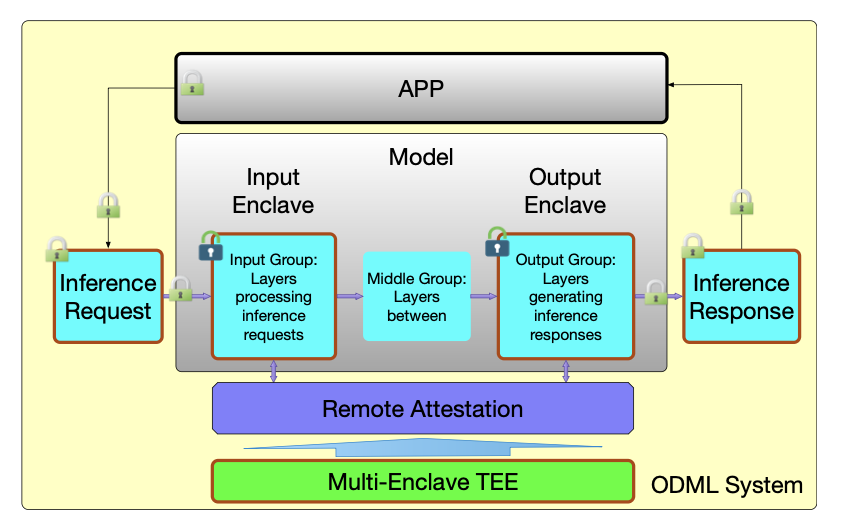

# SplitInference 🔐

Split Inference is designed to protect On-Device Machine Learning (ODML) models using Keystone, a RISC-V based multi‑enclave Trusted Execution Environment framework. It can prevent direct eavesdropping on and tampering with inference requests and inference responses during the model inference process. 

We have implemented prototypes protecting MobileNet and MobileViT, two classes of ODML models. Our implementation has shown premium performance and can be generalized to other Python-implemented models.

## 🚀 Highlights

- **Split Inference Architecture:** Model inference layers are partitioned into input, intermediate, and output groups across trusted input/output enclaves and an untrusted host, protecting both inference requests and responses while maintaining performance and generality.
- **Robust enclave-based key management:** Each app negotiates a unique encryption key with an Enclave using remote attestation, establishing per-app secure channels to enclaves.
- **Native & Hybrid Implementations on Keystone:** We implemented native (C/C++) and hybrid (Python + enclave C/C++) versions for MobileNetV1 and MobileViT models within the Keystone RISC‑V multi‑enclave TEE.
- **Strong performance:** Experimental evaluation shows inference overheads in the range of 27%–430%, significantly better than 142%–577% seen in prior work.
- **Generalized Solution:** The hybrid split inference architecture supports PyTorch and NumPy within the enclave, enabling seamless deployment of a wide range of ODML models implemented in Python.
- **Peer-reviewed:** The prototype work received the **Best Paper Award** at FMEC 2025.

---

## 📚 Table of Contents

- [Highlights](#-highlights)
- [Table of Contents](#-table-of-contents)
- [Publication](#publication)
- [Architecture](#architecture)
- [Implementation](#implementation)
- [Benchmarks](#benchmarks)
- [Getting Started](#getting-started)

---

## 🏆 Publication 

Yongzhi Wang, Ahsan Habib, "Protect Data Confidentiality for On-device Machine Learning through Split Inference", The 10th International Conference on Fog and Mobile Edge Computing (FMEC 2025), May 19-22, 2025, Tampa, Florida, USA **(Best Paper Award)** 🎉 [pdf](https://drvoyager.github.io/pdf/SplitInference_CameraReady.pdf)

---

## Architecture



Detailed design includes:

1. **Input Enclave**: decrypts and processes input layers.
2. **Middle Group**: untrusted execution of intermediate layers.
3. **Output Enclave**: final layers inside enclave, encrypts inference output.
4. **Key Management & Secure Communication Protocol:**  ensure confidentiality between each app and enclave through remote attestations.

This architecture ensures that no attacker observing inputs, intermediate data, or outputs can reconstruct the original inputs or outputs.

---

## Implementation

- **Native mode**: Entire inference pipeline translated into C/C++ and the input and output layers are executed inside Keystone enclaves—used for MobileNetV1 models.
- **Hybrid mode**: Python (with PyTorch & NumPy) executes middle layers on host, while input/output enclaves use C/C++—used for MobileViT.\
  This hybrid design allows easy adaptation to complex ODML models commonly implemented in Python.

---

## Benchmarks

We evaluated on MobileNetV1 variants (width multipliers 0.7, 0.5, 0.25) and MobileViTV1‑XXS with input image size 224×224:

| Model                | Overhead vs Baseline |
| -------------------- | -------------------- |
| MobileNetV1‑0.7‑224  | \~71%                |
| MobileNetV1‑0.5‑224  | \~133%               |
| MobileNetV1‑0.25‑224 | \~430%               |
| MobileViTV1‑XXS      | \~27%                |

Hybrid inference (MobileViT) achieves the lowest overhead while preserving strong security guarantees.

---

## Getting Started

```bash
git clone https://github.com/DrVoayger/SplitInference.git
cd SplitInference
# Follow `docs/INSTALL.md` for dependencies: QEMU, Keystone, Python toolchain
# Build native enclave: compile input/output enclave in C/C++
# Run hybrid version: port Python interpreter, PyTorch, Numpy into enclave workspace
```

Refer to `src/` for instructions and the code.

---